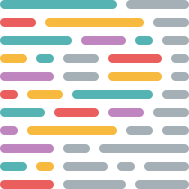

# Astro Shade DX Template

> **English** | [Español](#español)

<div align="center">
  <a href="https://www.npmjs.com/package/@hkxdv/astro-shade-dx-template">
    
  </a>
  &nbsp;&nbsp;&nbsp;
  <a href="https://opensource.org/licenses/MIT">
    
  </a>
  &nbsp;&nbsp;&nbsp;
  <div>
    <code style="background: none; color: white; display: block; text-align: center; font-size: 1.1em;">bunx @hkxdv/astro-shade-dx-template</code>
  </div>
</div>

---

<div align="center">
  <a href="https://astro.build/">
    
  </a>
  &nbsp;&nbsp;&nbsp;
  <a href="https://react.dev/">
    
  </a>
  &nbsp;&nbsp;&nbsp;
  <a href="https://tailwindcss.com/">
    
  </a>
  &nbsp;&nbsp;&nbsp;
  <a href="https://www.typescriptlang.org/">
    
  </a>
  &nbsp;&nbsp;&nbsp;
  <a href="https://bun.sh/">
    
  </a>
  &nbsp;&nbsp;&nbsp;
  <a href="https://ui.shadcn.com/">
    
  </a>
  &nbsp;&nbsp;&nbsp;
  <a href="https://biomejs.dev/">
    
  </a>
  &nbsp;&nbsp;&nbsp;
  <a href="https://prettier.io/">
    
  </a>
  &nbsp;&nbsp;&nbsp;
  <a href="https://eslint.org/">
    
  </a>
</div>

---

Astro template with React, shadcn/ui, Bun, Biome & ESLint. Pre-configured TypeScript, Tailwind CSS, dark/light themes, and optimized DX.

## Features

- **Astro**: Modern web framework for static sites and applications
- **shadcn/ui**: Beautiful, accessible components pre-configured
- **TailwindCSS**: Utility-first CSS framework
- **React**: Full support for React components
- **Optional Linting**: Configure ESLint + Prettier or Biome based on your preference (chosen interactively)
- **Dark/Light Theme**: Fully implemented theme system
- **Interactive CLI**: User-friendly interface to configure your project
- **Modular Code**: Organized and maintainable structure

## Installation & Usage

You don't need to install this package permanently. Simply use `bunx` to run the interactive setup wizard:

```bash
bunx @hkxdv/astro-shade-dx-template
```

The wizard will guide you through naming your project and selecting the template type (Demo or Base) and linter preference (Biome, ESLint, or None).

## Available Templates (Chosen Interactively)

- **demo**: Complete template with all shadcn/ui components, page examples, theme system, and advanced UI features.
- **base**: Minimal template with essential dependencies and basic components.

### Linter Options (Chosen Interactively)

- **Biome**: Single tool for formatting and linting with superior performance.
- **ESLint + Prettier**: Traditional setup with extensive rule customization.
- **None**: No linter configured.

---

<a name="español"></a>

# Astro Shade DX Template

> [English](#astro-shade-dx-template) | **Español**

<div align="center">
  <a href="https://www.npmjs.com/package/@hkxdv/astro-shade-dx-template">
    
  </a>
  &nbsp;&nbsp;&nbsp;
  <a href="https://opensource.org/licenses/MIT">
    
  </a>
  &nbsp;&nbsp;&nbsp;
  <div>
    <code style="background: none; color: white; display: block; text-align: center; font-size: 1.1em;">bunx @hkxdv/astro-shade-dx-template</code>
  </div>
</div>

---

<div align="center">
  <a href="https://astro.build/">
    
  </a>
  &nbsp;&nbsp;&nbsp;
  <a href="https://react.dev/">
    
  </a>
  &nbsp;&nbsp;&nbsp;
  <a href="https://tailwindcss.com/">
    
  </a>
  &nbsp;&nbsp;&nbsp;
  <a href="https://www.typescriptlang.org/">
    
  </a>
  &nbsp;&nbsp;&nbsp;
  <a href="https://bun.sh/">
    
  </a>
  &nbsp;&nbsp;&nbsp;
  <a href="https://ui.shadcn.com/">
    
  </a>
  &nbsp;&nbsp;&nbsp;
  <a href="https://biomejs.dev/">
    
  </a>
  &nbsp;&nbsp;&nbsp;
  <a href="https://prettier.io/">
    
  </a>
  &nbsp;&nbsp;&nbsp;
  <a href="https://eslint.org/">
    
  </a>
</div>

---

Plantilla para Astro con shadcn/ui preconfigurado, soporte para React, TailwindCSS y opciones de linting (ESLint + Prettier o Biome). Diseñado para una excelente experiencia de desarrollo (DX).

## Características

- **Astro**: Framework web moderno para sitios estáticos y aplicaciones
- **shadcn/ui**: Componentes hermosos y accesibles preconfigurados
- **TailwindCSS**: Utility-first CSS framework
- **React**: Soporte completo para componentes React
- **Linting opcional**: Configura ESLint + Prettier o Biome según tus preferencias (elegido interactivamente)
- **Tema oscuro/claro**: Sistema de temas completamente implementado
- **CLI interactivo**: Interfaz amigable para configurar tu proyecto
- **Código modular**: Estructura organizada y mantenible

## Instalación y Uso

No necesitas instalar este paquete permanentemente. Simplemente usa `bunx` para ejecutar el asistente de configuración interactivo:

```bash
bunx @hkxdv/astro-shade-dx-template
```

El asistente te guiará para nombrar tu proyecto y seleccionar el tipo de plantilla (Demo o Base) y la preferencia de linter (Biome, ESLint o Ninguno).

## Plantillas disponibles (Elegidas Interactivamente)

- **demo**: Plantilla completa con todos los componentes de shadcn/ui, ejemplos de páginas, sistema de temas y características UI avanzadas.
- **base**: Plantilla mínima con las dependencias esenciales y componentes básicos.

### Opciones de Linter (Elegidas Interactivamente)

- **Biome**: Herramienta única para formateo y linting con rendimiento superior.
- **ESLint + Prettier**: Configuración tradicional con amplia personalización de reglas.
- **Ninguno**: Sin linter configurado.
